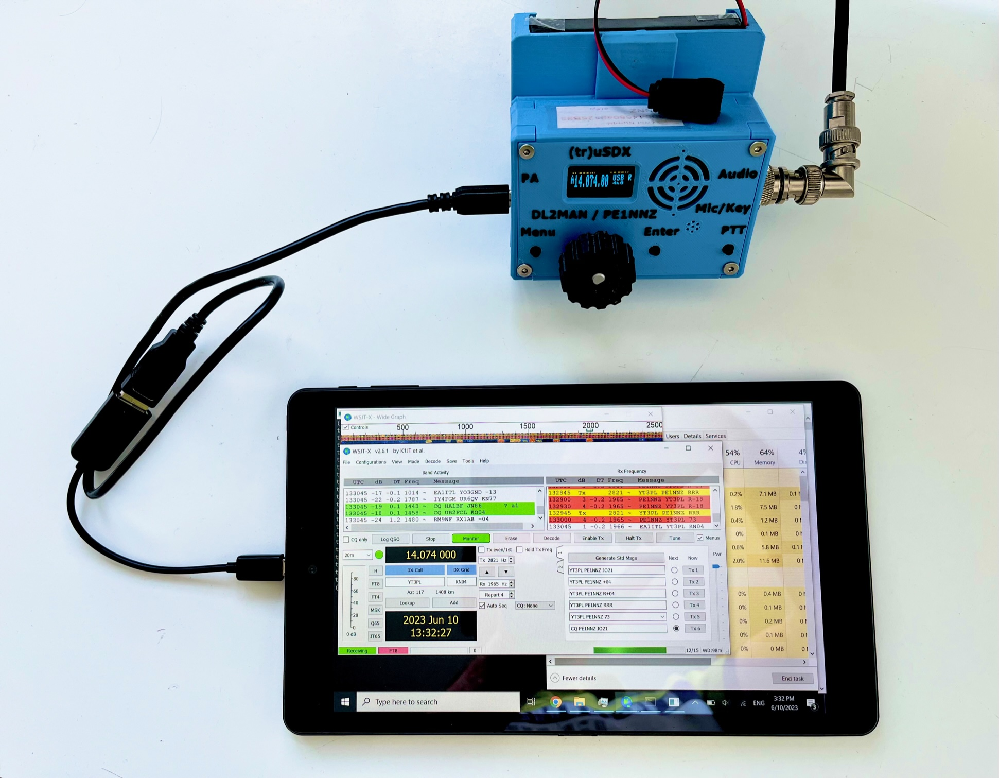

# trusdx-audio

This software allow you to send and receive audio to/from your (tr)uSDX (https://dl2man.de/) transceiver via the built-in USB-Serial port.

It enables operating in digital modes using nothing else but a laptop, (tr)uSDX and, obviously, an antenna. Optionally, the external 12V supply can be used for more power. No external audio interface is needed.

The software offers an internal Audio and CAT interface to connect to your digital mode application. For RX/TX switching can be done via: 1. CAT, 2. RTS/DTR (Windows ONLY), or 3. VOX (Linux ONLY with --vox option).  Internally, a virtual Audio and Serial Port device is used to bridge the digital modes app to the trusdx-audio app which in turn connects to the (tr)uSDX via [CAT streaming protocol](https://dl2man.de/5-trusdx-details/).

The software is available for Windows 8, 10 and 11, and Linux. Older Windows versions are supported, but a Virtual Serial port must be installed manually.

It has been successfully tested with:
- WSJT-X
- WSJT-Z
- JS8CALL
- FlDigi PSK31, RTTY
- Winlink (VARA)
- UZ7HO SoundModem Packet Radio

Here is an picture of the setup in action, a (tr)uSDX connected via USB to Windows (tablet) PC, streaming CAT and audio:

 
## Requirements

Make sure that the (tr)uSDX has firmware level [R2.00u](https://dl2man.de/wp-content/uploads/2022/01/wp.php/beta.html), or later.

You'll need a Windows 8/10/11 or Linux PC (Raspberry PI should be fine, too).

## Installation Windows

* Download the .EXE file from the [Releases page](https://github.com/threeme3/trusdx-audio/releases). Browser might warn about potential unsafe download, you can ignore this by selecting 'Keep'.

* Run the setup and follow instructions. Again Windows Protection might give a warning, you can ignore by selecting 'More info' and 'Run anyway'.

* Connect the (tr)uSDX to the USB port, set volume to 10

* Run from Start Menu the application: `truSDX Driver`

Start a digital modes app (e.g WSJT-X) and select in Radio settings:
- Rig: Kendwood TS-480 (you can also use TS-440 if not available. You can also opt to not use any CAT control if you prefer)
- Poll Interval: 80
- Serial Port: COM8
- Baud Rate: 115200
- PTT Method:  either CAT, or DTR/RTS with port COM8
- In Audio tab, select: for Input: `CABLE Output`, and for Output: `CABLE Input`

## Installation Linux

* Download `trusdx-txrx.py`
```
curl https://raw.githubusercontent.com/threeme3/trusdx-audio/main/trusdx-txrx.py -o trusdx-txrx.py
```

* Install pre-requisites PortAudio, PulseAudio, Python 3 and extra libraries: `pyserial` and `pyaudio`, e.g:
```
sudo apt install portaudio19-dev python3 python3-pip
python3 -m pip install --upgrade pip
python3 -m pip install pyaudio serial pyserial
```

* Create a new virtual audio device:
```pactl load-module module-null-sink sink_name=TRUSDX sink_properties=device.description="TRUSDX"```

* Run the script in terminal:
```python3 trusdx-txrx.py -v```.

* Use `pavucontrol` to assign the newly created `TRUSDX` audio device to the application you'd like to use for transmitting and receiving (or do that from the application itself, if it includes audio settings - WSJT-X does).

Start a digital modes app (e.g WSJT-X) and select in Radio settings:
- Rig: Kendwood TS-480 (or 440 if not available)
- Poll Interval: 80
- Serial Port: /dev/pts/x  (lookup in terminal which /dev/pts port is offered)
- Baud Rate: 115200
- PTT Method:  either CAT, or DTR/RTS with port /dev/pts/x
- In Audio tab, select: for Input: `TRUSDX` audio device, and for Output: `TRUSDX` audio device

## Notes
This software is experimental, no warranty or service included.

- The (tr)uSDX is muted by the driver, however if you like to hear the receiver audio you can add --unmute option (see below)

- The following options are available (for Windows use truSDX Driver.exe in Program Files directory):

```
usage: trusdx-txrx.py [-h] [-v] [--vox] [--unmute] [--no-rtsdtr] [-B BLOCK_SIZE]

(tr)uSDX audio driver

optional arguments:
  -h, --help            show this help message and exit
  -v, --verbose         increase verbosity (default: False)
  --vox                 VOX audio-triggered PTT (Linux only) (default: False)
  --unmute              Enable (tr)usdx audio (default: False)
  --no-rtsdtr           Disable RTS/DTR-triggered PTT (default: False)
  -B BLOCK_SIZE, --block-size BLOCK_SIZE
                        Block size (default: 512)
```


